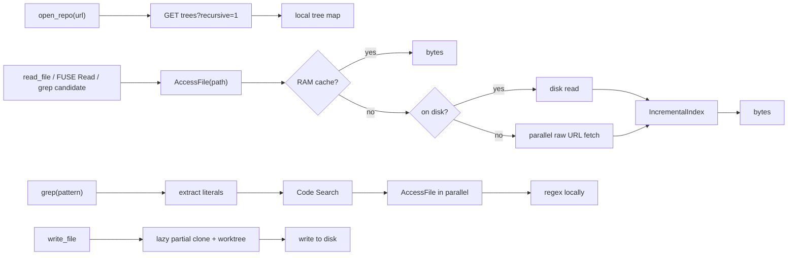

<p align="center">
  
</p>

<h1 align="center">glimpse</h1>

<p align="center">
  <strong>GitHub repos for agents — no clone required.</strong><br>
  Tree fetched at open. Files via CDN on access. Search via GitHub Code Search.<br>
  Local clone only when you write.
</p>

---

`glimpse` is an MCP server that gives AI agents fast read access to any `github.com` repository without cloning. The repository tree is fetched in one API call. Files stream from `raw.githubusercontent.com` on demand and are cached in memory. Search is delegated to GitHub's Code Search and the candidate files are downloaded in parallel for local regex matching. Writes lazily provision a partial bare clone and a sparse worktree.

## Why

| | `git clone` | `--filter=blob:none` | `glimpse` |
|---|---|---|---|
| Time to first read | minutes | seconds + per-file fetch | **~300 ms (one API call)** |
| Disk for read-only browsing | full repo | partial pack | **0** |
| Grep | local | per-blob promisor fetches | **GitHub Code Search + targeted CDN fetches** |
| Survives offline | yes | yes (after fetches) | no |
| Hosts supported | any | any | **github.com only** |

If you only ever need to read and search, glimpse never touches your disk. Clone only happens when an agent calls `write_file` or `git_commit`.

## Install

```bash
go install github.com/sumanthrao/glimpse/cmd/glimpse-mcp@latest
```

Print a ready-to-paste MCP config:

```bash
glimpse-mcp --print-mcp-config
```

## Wire it up

### Cursor — `.cursor/mcp.json`

```json
{
  "mcpServers": {
    "glimpse": {
      "command": "glimpse-mcp",
      "env": { "GITHUB_TOKEN": "ghp_..." }
    }
  }
}
```

### Claude Desktop / Code

Same shape, in `claude_desktop_config.json`.

`GITHUB_TOKEN` is optional but raises Code Search from 10 → 30 req/min and REST from 60 → 5000 req/hr. Strongly recommended for sustained agent use.

## Agent workflow

```
1. open_repo("https://github.com/owner/repo")
2. find_files / list_directory   -> explore (free, no network)
3. read_file                     -> fetch one file (CDN, ~100 ms)
4. grep                          -> Code Search + parallel fetch + local regex
5. write_file / git_*            -> triggers one-time partial clone (~5 s)
```

The MCP server's `initialize.instructions` carries this workflow into the agent's system prompt so it routes to the right tool without trial and error.

## Tools

| Tool | Cost | Use when |
|------|------|----------|
| `open_repo(url, ref?)` | 1 Trees API call (~300 ms) | Start of every session |
| `list_directory(path?)` | free | Browsing |
| `find_files(pattern, path?)` | free | Searching by filename |
| `file_info(path)` | free | Size / type / mode |
| `read_file(path)` | 1 CDN fetch cold; cached after | Reading a known file |
| `grep(pattern, path?)` | 1 Code Search + parallel CDN | Searching content; prefer literal anchors (3+ chars) |
| `repo_status()` | free | Cache state, index size, rate limits |
| `write_file(path, content)` | triggers lazy clone first time only | Editing |
| `git_status` / `git_diff` / `git_commit` | local after clone | Git ops on agent changes |
| `glimpse_help()` | free | Quick reference |

Every tool result includes a cost hint and, when something's incomplete, a suggested next step.

## Performance

For a typical 200 MB / 10 k file repo:

| | Cold | Warm |
|---|---|---|
| `open_repo` | ~300 ms (1 API call) | ~300 ms (refresh) |
| `list_directory`, `find_files`, `file_info` | < 1 ms | < 1 ms |
| `read_file` | ~100 ms | < 1 ms |
| `grep` literal-only | ~500 ms (Code Search snippets) | ~500 ms |
| `grep` regex with literals | ~1–2 s (Code Search + N parallel fetches) | < 10 ms (working set in RAM) |
| `write_file` (first call) | ~2–8 s (lazy partial clone) | < 5 ms |

Disk footprint stays at zero until a write happens.

## How it works



The bridge is `Backend.AccessFile(path) -> []byte`. Every caller (read, FUSE, grep) goes through it. Every byte returned is added to a working-set trigram index keyed by blob SHA, so regex queries with no literal anchors still work over files the agent has already touched.

## Limitations

- **GitHub only.** Non-github URLs are rejected.
- **Code Search has indexing lag.** Recent commits may not be searchable for a few minutes. After a write, `git grep` over the lazy worktree is the fallback for "find my own changes".
- **Code Search excludes files >384 KB and some forks.** Once the agent reads such a file, the working-set index covers it.
- **Trees API caps at 100k entries.** Monorepos beyond that aren't supported in v1.
- **Network required for cold reads.** No offline mode.
- **Rate limits without a token are tight.** Set `GITHUB_TOKEN` for sustained agent use.

## License

Apache 2.0 — see [LICENSE](LICENSE).
